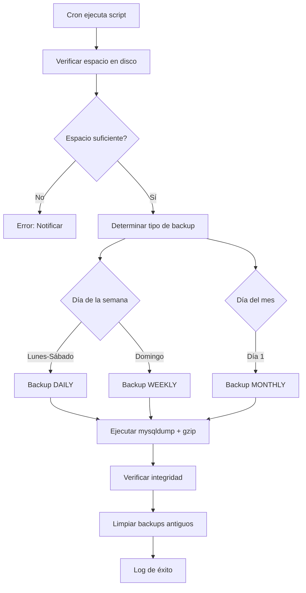

# 💾 SISTEMA DE BACKUP AUTOMÁTICO DE BASE DE DATOS
## Sistema de Facturación v3.3

---

## 📋 RESUMEN EJECUTIVO

Sistema automatizado de backup con estrategia GFS (Grandfather-Father-Son) que garantiza:
- ✅ Backups diarios automáticos
- ✅ Retención inteligente (7 días, 4 semanas, 12 meses)
- ✅ Compresión automática
- ✅ Verificación de integridad
- ✅ Restauración simple y segura

---

## 🏗️ ARQUITECTURA DEL SISTEMA

### Estrategia GFS (Grandfather-Father-Son)

```
📦 /var/backups/facturacion/
├── 📁 daily/          → Backups diarios (últimos 7 días)
│   ├── backup_dbsistema_20251010_020000.sql.gz
│   ├── backup_dbsistema_20251009_020000.sql.gz
│   └── ...
├── 📁 weekly/         → Backups semanales (últimos 4 domingos)
│   ├── backup_dbsistema_weekly_20251007_020000.sql.gz
│   └── ...
└── 📁 monthly/        → Backups mensuales (últimos 12 meses)
    ├── backup_dbsistema_monthly_20251001_020000.sql.gz
    └── ...
```

### Flujo de Backup



---

## 🚀 INSTALACIÓN

### Paso 1: Preparar Directorios

```bash
# Crear estructura de directorios
sudo mkdir -p /var/backups/facturacion/{daily,weekly,monthly,pre_restore}

# Configurar permisos
sudo chown -R www-data:www-data /var/backups/facturacion
sudo chmod 750 /var/backups/facturacion
sudo chmod 750 /var/backups/facturacion/*
```

### Paso 2: Configurar Scripts

```bash
# Copiar scripts
cd /path/to/proyecto/scripts
sudo cp backup_database.sh /usr/local/bin/
sudo cp restore_database.sh /usr/local/bin/

# Dar permisos de ejecución
sudo chmod +x /usr/local/bin/backup_database.sh
sudo chmod +x /usr/local/bin/restore_database.sh
```

### Paso 3: Configurar Credenciales

Editar `/usr/local/bin/backup_database.sh`:

```bash
# Opción 1: Contraseña en el script (NO recomendado para producción)
DB_USER="root"
DB_PASSWORD="tu_password_seguro"
DB_HOST="localhost"
DB_NAME="dbsistema"

# Opción 2: Usar archivo .my.cnf (RECOMENDADO)
# Crear /root/.my.cnf con:
# [client]
# user=root
# password=tu_password_seguro
# host=localhost
```

### Paso 4: Configurar Cron

```bash
# Editar crontab
sudo crontab -e

# Agregar línea para backup diario a las 2:00 AM
0 2 * * * /usr/local/bin/backup_database.sh >> /var/log/backup_db.log 2>&1

# Agregar línea para verificación semanal (opcional)
0 3 * * 0 /usr/local/bin/verify_backups.sh >> /var/log/backup_verify.log 2>&1
```

### Paso 5: Probar Instalación

```bash
# Ejecutar backup manual
sudo /usr/local/bin/backup_database.sh

# Verificar resultado
ls -lh /var/backups/facturacion/daily/

# Ver log
tail -f /var/log/backup_db.log
```

---

## 📊 CONFIGURACIÓN

### Parámetros Editables en `backup_database.sh`

```bash
# Retención de backups (cantidad a mantener)
DAILY_RETENTION=7     # 7 días
WEEKLY_RETENTION=4    # 4 semanas
MONTHLY_RETENTION=12  # 12 meses

# Directorios
BACKUP_ROOT="/var/backups/facturacion"

# Notificaciones por email (opcional)
NOTIFICATION_EMAIL="admin@miempresa.com"
```

### Opciones de mysqldump

El script usa las siguientes opciones:

```bash
--single-transaction  # Backup consistente sin bloquear tablas (InnoDB)
--routines            # Incluir procedimientos almacenados
--triggers            # Incluir triggers
--events              # Incluir eventos programados
```

---

## 🔄 USO DEL SISTEMA

### Backup Manual

```bash
# Ejecutar backup ahora
sudo /usr/local/bin/backup_database.sh

# Ver progreso
tail -f /var/log/backup_db.log
```

### Listar Backups Disponibles

```bash
# Ver todos los backups
ls -lhR /var/backups/facturacion/

# Ver solo backups diarios
ls -lht /var/backups/facturacion/daily/

# Ver tamaño total
du -sh /var/backups/facturacion/
```

### Restaurar Base de Datos

#### Método 1: Script Interactivo (RECOMENDADO)

```bash
# El script te guiará paso a paso
sudo /usr/local/bin/restore_database.sh

# Listar backups y elegir uno
sudo /usr/local/bin/restore_database.sh /var/backups/facturacion/daily/backup_dbsistema_20251010_020000.sql.gz
```

#### Método 2: Manual

```bash
# Descomprimir y restaurar
gunzip < /var/backups/facturacion/daily/backup_dbsistema_20251010_020000.sql.gz | mysql -u root -p dbsistema
```

---

## 🛡️ SEGURIDAD Y MEJORES PRÁCTICAS

### Seguridad de Backups

```bash
# 1. Proteger con permisos restrictivos
sudo chmod 600 /var/backups/facturacion/*/*.sql.gz

# 2. Cifrar backups sensibles (opcional)
gpg --symmetric --cipher-algo AES256 backup.sql.gz

# 3. Almacenar fuera del servidor (CRÍTICO)
rsync -avz /var/backups/facturacion/ usuario@servidor-remoto:/backups/
```

### Backup Offsite (Recomendado)

#### Opción 1: rsync a servidor remoto

```bash
# Agregar a cron después del backup
5 2 * * * rsync -avz --delete /var/backups/facturacion/ usuario@backup-server:/backups/facturacion/
```

#### Opción 2: AWS S3

```bash
# Instalar AWS CLI
sudo apt install awscli

# Configurar credenciales
aws configure

# Script de sincronización
aws s3 sync /var/backups/facturacion/ s3://mi-bucket-backups/facturacion/
```

#### Opción 3: Google Drive (rclone)

```bash
# Instalar rclone
sudo apt install rclone

# Configurar
rclone config

# Sincronizar
rclone sync /var/backups/facturacion/ gdrive:backups/facturacion/
```

---

## 📈 MONITOREO Y ALERTAS

### Verificar Estado de Backups

```bash
# Ver último backup
ls -lht /var/backups/facturacion/daily/ | head -1

# Ver log de éxitos
grep "COMPLETADO EXITOSAMENTE" /var/log/backup_db.log | tail -5

# Ver log de errores
cat /var/log/backup_db_error.log
```

### Script de Verificación de Integridad

Crear `/usr/local/bin/verify_backups.sh`:

```bash
#!/bin/bash

echo "=== Verificación de Backups ==="
echo ""

for backup in /var/backups/facturacion/*/*.sql.gz; do
    if gzip -t "$backup" 2>/dev/null; then
        echo "✅ OK: $(basename "$backup")"
    else
        echo "❌ CORRUPTO: $(basename "$backup")"
    fi
done
```

### Configurar Alertas por Email

```bash
# Instalar mailutils
sudo apt install mailutils

# Probar envío
echo "Test" | mail -s "Prueba" admin@miempresa.com

# Configurar en backup_database.sh
NOTIFICATION_EMAIL="admin@miempresa.com"
```

### Integración con Monitoring (Opcional)

```bash
# Crear healthcheck endpoint
curl -fsS -m 10 --retry 5 -o /dev/null https://hc-ping.com/tu-uuid-healthcheck

# Agregar al final de backup_database.sh para notificar éxito
if [ $? -eq 0 ]; then
    curl -fsS -m 10 --retry 5 -o /dev/null https://hc-ping.com/tu-uuid
fi
```

---

## 🔧 SOLUCIÓN DE PROBLEMAS

### Problema: "Espacio en disco insuficiente"

```bash
# Ver espacio disponible
df -h /var/backups

# Limpiar backups antiguos manualmente
find /var/backups/facturacion/daily -mtime +30 -delete

# Aumentar retención o agregar más espacio
```

### Problema: "mysqldump: command not found"

```bash
# Ubuntu/Debian
sudo apt install mysql-client

# CentOS/RHEL
sudo yum install mysql

# Verificar instalación
mysqldump --version
```

### Problema: "Access denied for user"

```bash
# Verificar credenciales
mysql -u root -p -e "SELECT 1"

# Opción 1: Usar archivo .my.cnf
cat > /root/.my.cnf << EOF
[client]
user=root
password=tu_password
EOF

chmod 600 /root/.my.cnf

# Opción 2: Crear usuario específico para backups
mysql -u root -p << EOF
CREATE USER 'backup'@'localhost' IDENTIFIED BY 'password_seguro';
GRANT SELECT, LOCK TABLES, SHOW VIEW, TRIGGER ON dbsistema.* TO 'backup'@'localhost';
FLUSH PRIVILEGES;
EOF
```

### Problema: "Backup corrupto al restaurar"

```bash
# Verificar integridad del archivo
gzip -t backup.sql.gz

# Intentar reparar
gunzip backup.sql.gz
gzip -c backup.sql > backup_fixed.sql.gz

# Usar backup anterior
ls -lht /var/backups/facturacion/daily/ | head -5
```

---

## 📅 CALENDARIO DE MANTENIMIENTO

### Diario (Automático)
- ✅ Backup ejecutado a las 2:00 AM
- ✅ Limpieza de backups diarios > 7 días

### Semanal (Automático)
- ✅ Backup semanal cada domingo
- ✅ Limpieza de backups semanales > 4 semanas

### Mensual (Manual)
- 🔍 Verificar espacio en disco
- 🔍 Probar restauración de un backup aleatorio
- 🔍 Revisar logs de errores

### Trimestral (Manual)
- 🔍 Revisar y actualizar políticas de retención
- 🔍 Verificar backups offsite
- 🔍 Documentar cambios en el sistema

---

## 📊 ESTADÍSTICAS Y MÉTRICAS

### Consultas Útiles

```bash
# Cantidad de backups por tipo
echo "Diarios: $(ls /var/backups/facturacion/daily/*.sql.gz 2>/dev/null | wc -l)"
echo "Semanales: $(ls /var/backups/facturacion/weekly/*.sql.gz 2>/dev/null | wc -l)"
echo "Mensuales: $(ls /var/backups/facturacion/monthly/*.sql.gz 2>/dev/null | wc -l)"

# Espacio usado por backups
du -sh /var/backups/facturacion/*

# Tasa de compresión promedio
for backup in /var/backups/facturacion/daily/*.sql.gz; do
    gunzip -c "$backup" | wc -c
done | awk '{sum+=$1} END {print "Promedio sin comprimir:", sum/NR/1024/1024, "MB"}'

# Último backup exitoso
grep "COMPLETADO EXITOSAMENTE" /var/log/backup_db.log | tail -1
```

---

## 🔐 COMPLIANCE Y AUDITORÍA

### Requisitos de Compliance

Para cumplir con estándares como:
- **ISO 27001**: Backups cifrados y offsite
- **PCI-DSS**: Retención mínima 1 año
- **GDPR**: Cifrado de PII en backups

### Configuración para Compliance

```bash
# 1. Cifrar backups automáticamente
# Modificar backup_database.sh para agregar:
gpg --batch --yes --passphrase-file /root/.backup_passphrase \
    --symmetric --cipher-algo AES256 "$BACKUP_FILE"

# 2. Extender retención para compliance
MONTHLY_RETENTION=12  # 12 meses mínimo

# 3. Almacenar offsite obligatorio
rsync -avz --delete /var/backups/facturacion/ offsite-server:/backups/
```

### Registro de Auditoría

```bash
# Crear log de auditoría de restauraciones
echo "[$(date)] Usuario: $USER, Acción: RESTORE, Archivo: $BACKUP_FILE" >> /var/log/backup_audit.log

# Revisar auditoría
cat /var/log/backup_audit.log
```

---

## 📚 REFERENCIAS

### Documentación Adicional
- [MySQL Backup and Recovery](https://dev.mysql.com/doc/refman/8.0/en/backup-and-recovery.html)
- [Estrategia GFS de Backup](https://en.wikipedia.org/wiki/Backup_rotation_scheme)
- [Best Practices para mysqldump](https://dev.mysql.com/doc/refman/8.0/en/mysqldump.html)

### Scripts Relacionados
- `/scripts/backup_database.sh` - Script principal de backup
- `/scripts/restore_database.sh` - Script de restauración
- `/config/Conexion.php` - Configuración de BD

---

## ✅ CHECKLIST DE IMPLEMENTACIÓN

### Pre-Implementación
- [ ] Verificar espacio en disco disponible (mínimo 10GB)
- [ ] Instalar mysql-client o mariadb-client
- [ ] Crear directorios de backup con permisos correctos
- [ ] Configurar credenciales de BD de forma segura

### Implementación
- [ ] Copiar scripts a /usr/local/bin
- [ ] Dar permisos de ejecución (+x)
- [ ] Configurar parámetros en backup_database.sh
- [ ] Configurar cron para ejecución automática
- [ ] Realizar backup de prueba manual

### Post-Implementación
- [ ] Verificar primer backup automático
- [ ] Probar restauración con backup de prueba
- [ ] Configurar backup offsite
- [ ] Establecer alertas de monitoreo
- [ ] Documentar procedimiento de restauración para equipo
- [ ] Programar revisión trimestral

---

**Última actualización**: 2025-10-10
**Versión del documento**: 1.0
**Sistema**: Facturación v3.3
